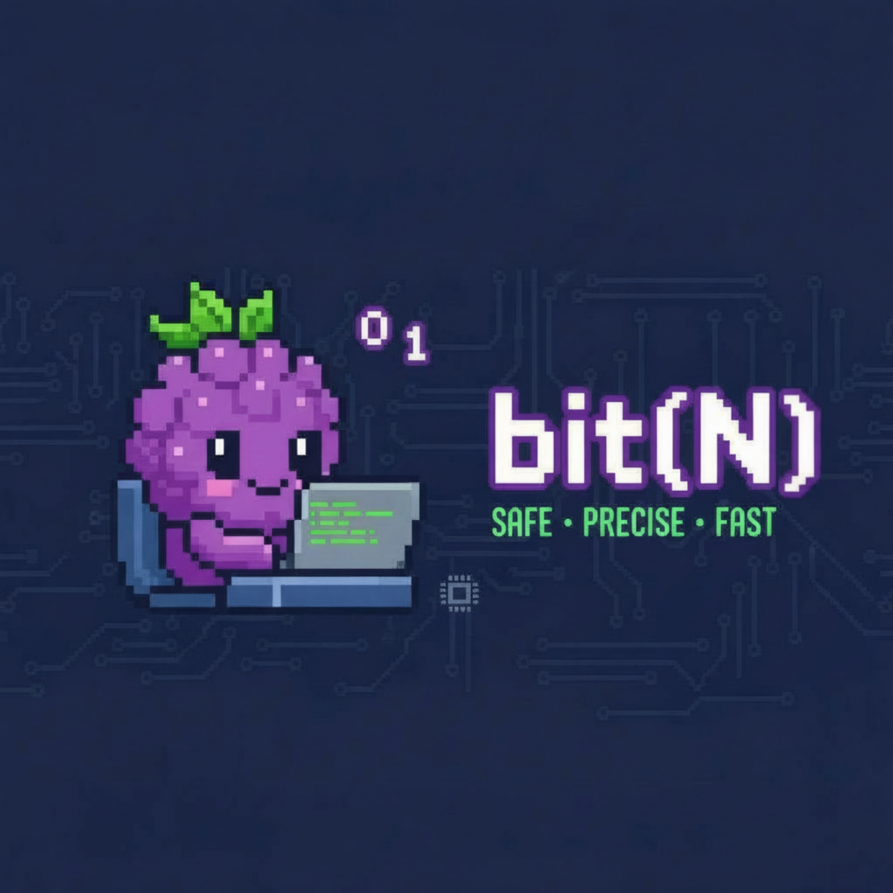

# bit(N) Compiler - Language Guide


## Status: Phase 2 Complete ✅ | Peripheral DSL Support Added 🎯

**Latest Update:** Full peripheral DSL support implemented! Namespace structure for MCU definitions added. Semantic analysis framework extended for hardware abstractions.

The bit(N) compiler now includes:
- ✅ Lexical analysis (tokenization) - Complete with DSL tokens
- ✅ Syntax analysis (parsing) - Indentation-based blocks + peripherals
- ✅ AST construction - Functions AND peripheral definitions
- ✅ Type system integration
- ✅ Semantic analysis (symbol table, type inference)
- ✅ **Peripheral DSL parsing** - register, field, access modes

---

## Quick Start

### Installation

```bash
cd ~/bit-n
bash bitN_setup.sh
```

### First Program

```bash
./build/bitN examples/basic.bitn
```

### Expected Output

```
=== bit(N) Compiler with DSL Support ===

--- Lexical Analysis ---
Token(PROC, ...)
...

--- Parsing ---
✅ Successfully parsed
   Functions: 1
   Peripherals: 0
```

---

## Language Features

### 1. Functions (proc/func)

Define functions with explicit return types:

```bitn
proc add(x: u32, y: u32): u32 =
  return add(x, y)

fn test_gpio() -> u32 =
  return 0x00001234
```

**Syntax:**
- `proc` or `func` keyword marks function definition
- Parameters with type annotations: `name: type`
- Return type after `:`: `: type` (proc) or `-> type` (fn)
- Body uses indentation (no braces)
- `proc` uses `: type =` syntax
- `fn` uses `-> type { }` syntax

---

### 2. Peripheral Definitions (DSL)

Define hardware peripherals with registers and fields:

```bitn
peripheral GPIO @ 0x40014000 {
    register GPIO_OE: u32 @ 0x20 {
        field OE_0: [0:1]   rw;
        field OE_1: [1:2]   rw;
        field OE_2: [2:3]   rw;
    }
    
    register GPIO_IN: u32 @ 0x24 {
        field IN_0: [0:1]   ro;
        field IN_1: [1:2]   ro;
    }
}
```

**Syntax:**
- `peripheral NAME @ BASE_ADDRESS { ... }`
- Base address in hex (e.g., `0x40014000`)
- Inside: register definitions
- Each `register NAME: TYPE @ OFFSET { ... }`
- Register offset in hex
- Inside registers: field definitions
- Each `field NAME: [START:END] ACCESS_MODE;`
- Bit range inclusive (e.g., `[0:1]` = bits 0-1)
- Access modes: `ro` (read-only), `wo` (write-only), `rw` (read-write), `w1c` (write-1-to-clear)

**Features:**
- ✅ Parse peripheral definitions
- ✅ Parse register layouts with offsets
- ✅ Parse field bit ranges
- ✅ Parse access specifiers
- ✅ Mix functions and peripherals in same file
- ✅ Multiple peripherals supported

---

### 3. Type System

#### Unsigned Integers
- `u8` - 8-bit (0 to 255)
- `u16` - 16-bit (0 to 65,535)
- `u32` - 32-bit (0 to 4.3 billion)
- `u64` - 64-bit (0 to 18.4 quintillion)

#### Signed Integers
- `i8`, `i16`, `i32`, `i64` - Signed equivalents

#### Special Types
- `void` - No return value

---

### 4. Named Arithmetic Operators

```bitn
proc math(): u32 =
  let a: u32 = 10
  let b: u32 = 3
  
  let sum: u32 = add(a, b)           // 13
  let diff: u32 = sub(a, b)          // 7
  let product: u32 = mul(a, b)       // 30
  let quotient: u32 = div(a, b)      // 3
  let remainder: u32 = mod(a, b)     // 1
  
  return quotient
```

**Operators:**
- `add(x, y)` - Addition
- `sub(x, y)` - Subtraction
- `mul(x, y)` - Multiplication
- `div(x, y)` - Division
- `mod(x, y)` - Modulo
- `neg(x)` - Negation

---

### 5. Named Bitwise Operators

```bitn
proc bitwise(): u32 =
  let a: u32 = 0xAA
  let b: u32 = 0x55
  
  let and_result: u32 = bitand(a, b)     // AND
  let or_result: u32 = bitor(a, b)       // OR
  let xor_result: u32 = bitxor(a, b)     // XOR
  let left_shift: u32 = shl(a, 4)        // Left shift
  let right_shift: u32 = shr(a, 2)       // Right shift
  
  return xor_result
```

**Operators:**
- `bitand(x, y)` - Bitwise AND
- `bitor(x, y)` - Bitwise OR
- `bitxor(x, y)` - Bitwise XOR
- `shl(x, n)` - Left shift
- `shr(x, n)` - Right shift
- `bitnot(x)` - Bitwise NOT

---

### 6. Variables

```bitn
proc example(): u32 =
  let x: u32 = 10          // Immutable
  var y: u32 = 20          // Mutable
  let result: u32 = add(x, y)
  return result
```

**Syntax:**
- `let name: type = value` - Immutable
- `var name: type = value` - Mutable
- Type annotation required
- Values must match type

---

## Example Programs

### Example 1: GPIO Peripheral

```bitn
peripheral GPIO @ 0x40014000 {
    register GPIO_OE: u32 @ 0x20 {
        field OE_0: [0:1]   rw;
        field OE_1: [1:2]   rw;
        field OE_2: [2:3]   rw;
        field OE_3: [3:4]   rw;
    }
    
    register GPIO_IN: u32 @ 0x24 {
        field IN_0: [0:1]   ro;
        field IN_1: [1:2]   ro;
        field IN_2: [2:3]   ro;
        field IN_3: [3:4]   ro;
    }
    
    register GPIO_OUT: u32 @ 0x28 {
        field OUT_0: [0:1]   rw;
        field OUT_1: [1:2]   rw;
        field OUT_2: [2:3]   rw;
        field OUT_3: [3:4]   rw;
    }
}

fn test_gpio() -> u32 {
    return 0x00001234;
}
```

### Example 2: Bit Operations

```bitn
proc bit_operations(): u32 =
  let a: u32 = 0xAAAA
  let b: u32 = 0x5555
  let and_result: u32 = bitand(a, b)
  let or_result: u32 = bitor(a, b)
  let xor_result: u32 = bitxor(a, b)
  return xor_result
```

### Example 3: Arithmetic

```bitn
proc math_ops(): u32 =
  let x: u32 = 100
  let y: u32 = 25
  let result: u32 = div(x, y)
  return result
```

---

## Usage

### Compile from Command Line

#### Inline Code
```bash
./build/bitN -c 'proc main(): u32 = return 42'
```

#### From File
```bash
./build/bitN examples/gpio_example.bitn
```

---

## Compiler Phases

### Phase 1: Lexical Analysis
- Tokenizes input
- Recognizes keywords: `proc`, `func`, `let`, `var`, `return`, `peripheral`, `register`, `field`
- Parses numbers: decimal, hex (0x...), binary (0b...)
- Identifies operators and delimiters
- Tracks line/column positions

### Phase 2: Syntax Analysis
- Builds Abstract Syntax Tree
- Validates function definitions
- Validates peripheral definitions
- Parses field bit ranges and access modes
- Handles indentation-based blocks

### Phase 3: Semantic Analysis
- Tracks variable declarations
- Infers expression types
- Validates type compatibility
- Detects undefined variables

### Phase 4: Type Checking
- Validates function return types
- Checks variable initializations
- Ensures type correctness

---

## Current Capabilities

### What Works ✅
- Parse functions (proc/func/fn)
- Parse peripheral definitions
- Parse register layouts
- Parse field bit ranges
- Recognize access modes (ro, wo, rw, w1c)
- Handle all number formats
- Support all named operators
- Validate type annotations
- Check function return types
- Track variable scopes
- Full three-phase compilation pipeline
- Mix functions and peripherals in same file

### What's Coming 🔧
- Better error messages
- Advanced control flow
- Variable scope refinement

### Future Enhancements 🚀
- Code generation
- Bitfield support (Phase 3)
- Struct definitions
- Array/pointer support
- Optimization passes

---

## File Organization

### Headers (`include/`)
- `token.h` - Token definitions
- `lexer.h` - Lexer interface
- `ast.h` - AST structures (including peripheral nodes)
- `parser.h` - Parser interface
- `type_system.h` - Type definitions
- `symbol_table.h` - Symbol table API

### Sources (`src/`)
- `token.c` - Token utilities
- `lexer.c` - Lexical analyzer
- `ast.c` - AST management
- `parser.c` - Parser implementation (peripheral parsing)
- `type_system.c` - Type operations
- `symbol_table.c` - Scope tracking
- `main.c` - Compiler entry point

### Examples (`examples/`)
- `basic.bitn` - Simple function
- `gpio_example.bitn` - GPIO peripheral definition
- `bit_manipulation.bitn` - Bitwise operations

### MCU Definitions (`mcu/`)
- `rp2040/` - Raspberry Pi Pico definitions (WIP)
  - `gpio.bitn` - GPIO peripheral
  - `uart.bitn` - UART peripheral (planned)
  - `spi.bitn` - SPI peripheral (planned)

---

## Troubleshooting

### Parse Errors
Check:
1. Function syntax: `proc name(): type = ...` or `fn name() -> type { ... }`
2. Peripheral syntax: `peripheral name @ address { ... }`
3. Register syntax: `register name: type @ offset { ... }`
4. Field syntax: `field name: [start:end] access_mode;`
5. Type annotations present
6. Proper indentation

### Build Failures
```bash
cd ~/bit-n
rm -rf build
bash bitN_setup.sh
```

---

## Getting Started

1. Build:
   ```bash
   bash bitN_setup.sh
   ```

2. Try examples:
   ```bash
   ./build/bitN examples/basic.bitn
   ./build/bitN examples/gpio_example.bitn
   ```

3. Expected success:
   ```
   ✅ Successfully parsed
   --- Semantic Analysis ---
   ✅ Semantic analysis passed
   ```

---

## For More Information

- **Implementation:** See `IMPLEMENTATION.md`
- **Roadmap:** See `ROADMAP.md`
- **Vision:** See `VISION.md`

---

**Ready to work with peripheral definitions!** 🚀